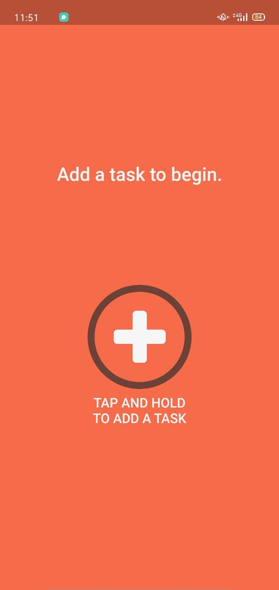
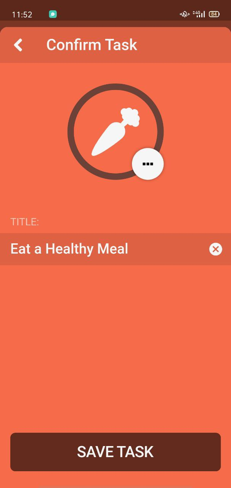
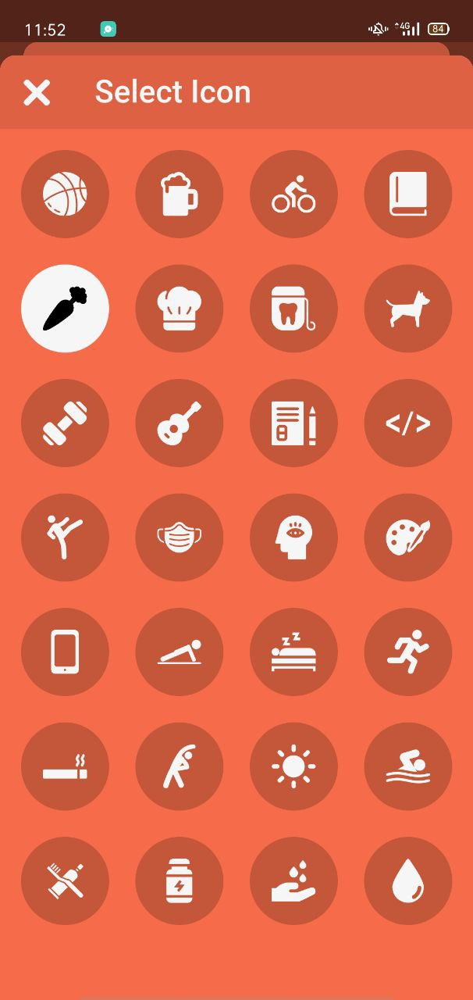
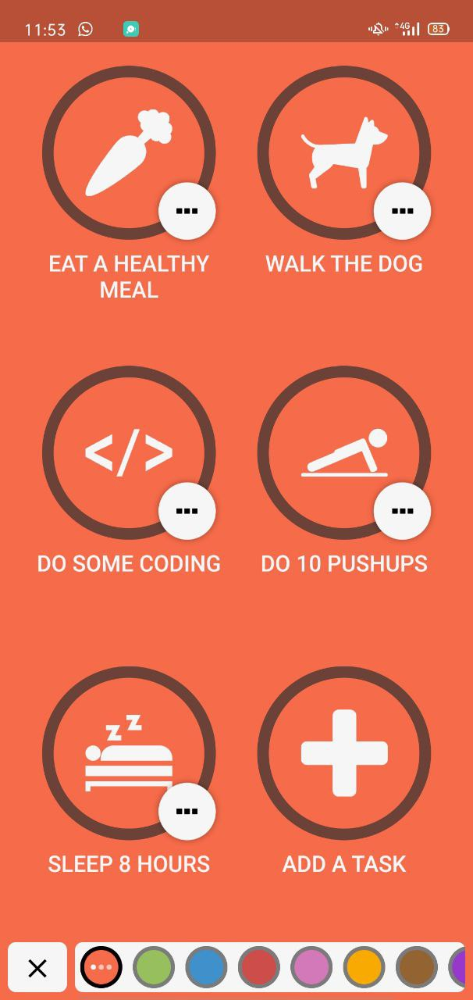
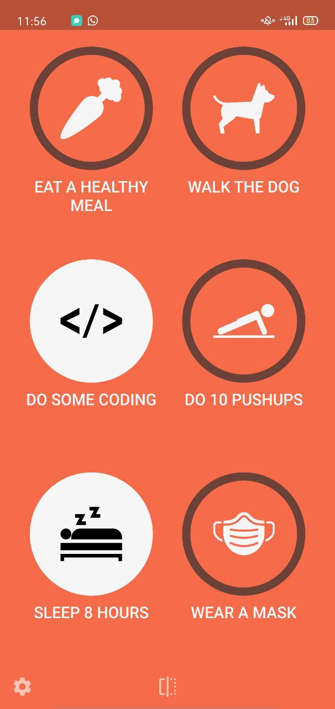
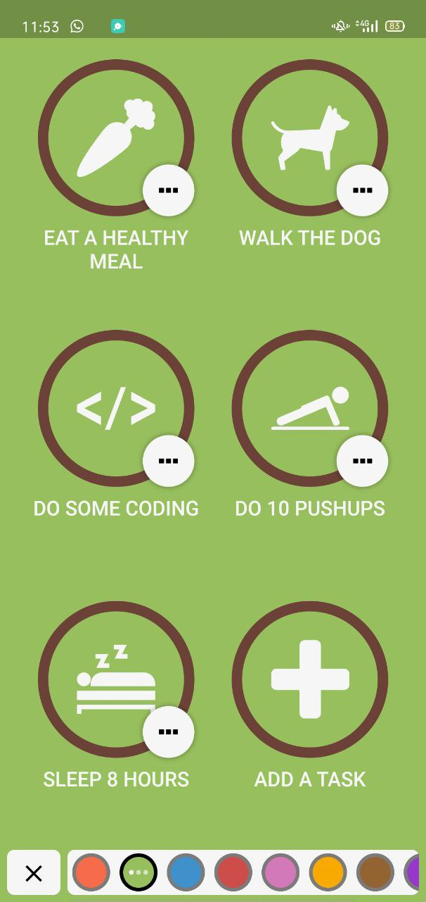
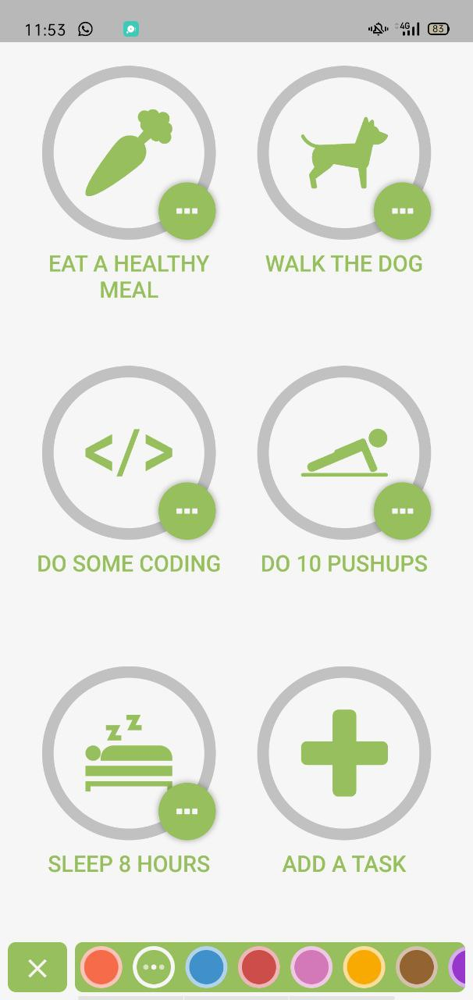

# Flutter Habit Tracker App

It's an open source project for Tracking daily activities built with Flutter and integrated with Hive local storage.

### The idea for this project based on [Streaks App](https://streaksapp.com/)

## Features✨
- [x] **Create**, **Edit**, **Delete** tasks with nice animation
- [x] **View** Tasks to user in gride view
- [x] Change Task State `Completed` and `Not Compeletd`
- [x] Change **App theme** from slid panel
- [x] **Multi Themes** for both **dark** and **light** theme
- [x] Page flipping

## Overview

https://user-images.githubusercontent.com/37798971/176403625-f98083ae-80ba-4ca5-87e7-dcdcb6730067.mp4

## Screenshots 📷

|                                                         |                                |                                                 |
| ------------------------------------------------------- | ------------------------------ | ----------------------------------------------  |
|  |  |  |
|  |  |    |
|  |  |  |

## App Challenges
1- **Task completion ring**
   - Using `CustomPainter` to draw the ring
   - Add explicit animations with `AnimationController` and `AnimatedBuilder`
   - Controlling the animation with `GestureDetector`
   - Adding a centered SVG icon to the animated task
   - Task completion state and final tweaks
   
2- **Local Data Persistence with Hive**
   - Creating model classes with Hive
   - Creating `HiveDataStore` Class 
   - Creating unique Task IDs with the `uuid ` package
    
3- **State Management with Riverpod**
   - Creating and using a data store with `Provider` and `Consumer`
   - Add Dependency overrides with `ProviderScope`
   - Add `TaskState` data modelling 
   - Using `TaskState` in Hive model class

4- **Page Flip Animation**
   - Designing the Page Flip widget API with WidgetBuilders
   - Using a `GlobalKey` to modify the state of a child widget
   - Using `AnimationController` to set the aimation
   - Using `Transform` and `Matrix4` to rotate the page
   
5- **Advanced Theming**
   - Showing the bottom panels
   - Adding a SlidingPanelAnimator
   - Animating the sliding panels
   - Managing app theme state changes with `Riverpod`
   - Implementing the AppThemeManager class with StateNotifier
   - Creating and using the AppThemeManager providers
   - Applying the AppThemeSettings
   - Advanced animated theming with ImplicitlyAnimatedWidget
  
6- **Add and Edit Tasks**
   - Navigating to the Add Task and Edit Task pages
   - AddTaskPage with `Slivers`
   - TaskDetailsPage and SelectIconPage
   - Onbording
   
 ## Useful resources 
 - [Advanced Flutter: Matrix4 And Perspective Transformations](https://medium.com/flutter-community/advanced-flutter-matrix4-and-perspective-transformations-a79404a0d828)
 - [Introduction to animations | Flutter.dev](https://docs.flutter.dev/development/ui/animations)
 - [Animations overview](https://docs.flutter.dev/development/ui/animations/overview)
 - [Animation Tutorials](https://docs.flutter.dev/development/ui/animations/tutorial)
 - [Implicit animations](https://docs.flutter.dev/development/ui/animations/implicit-animations)
 - [Hero animations](https://docs.flutter.dev/development/ui/animations/hero-animations)
 - [Staggered animations](https://docs.flutter.dev/development/ui/animations/staggered-animations)
 - [Performance](https://docs.flutter.dev/perf)
 
  
  
   
   
